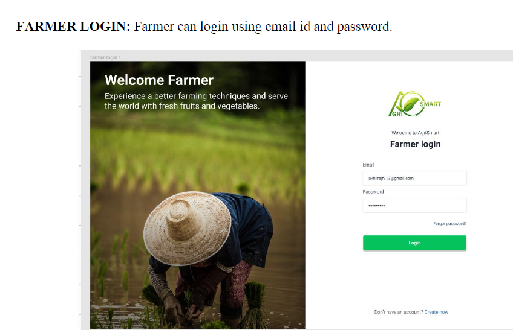
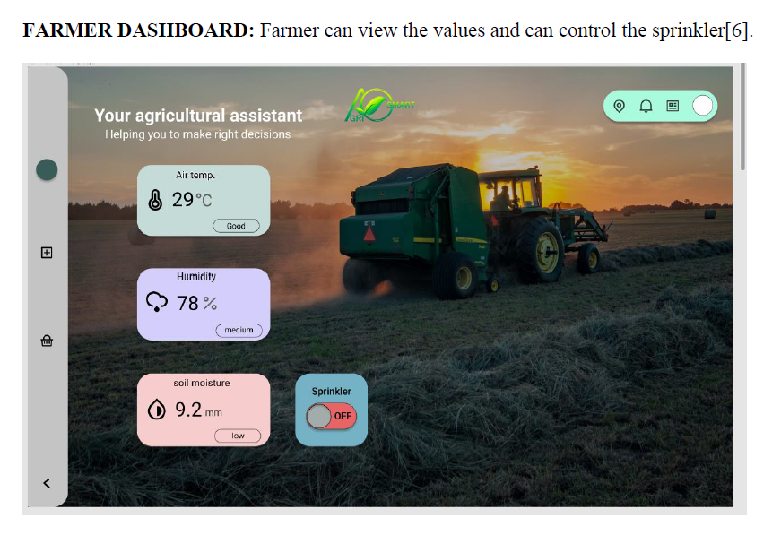
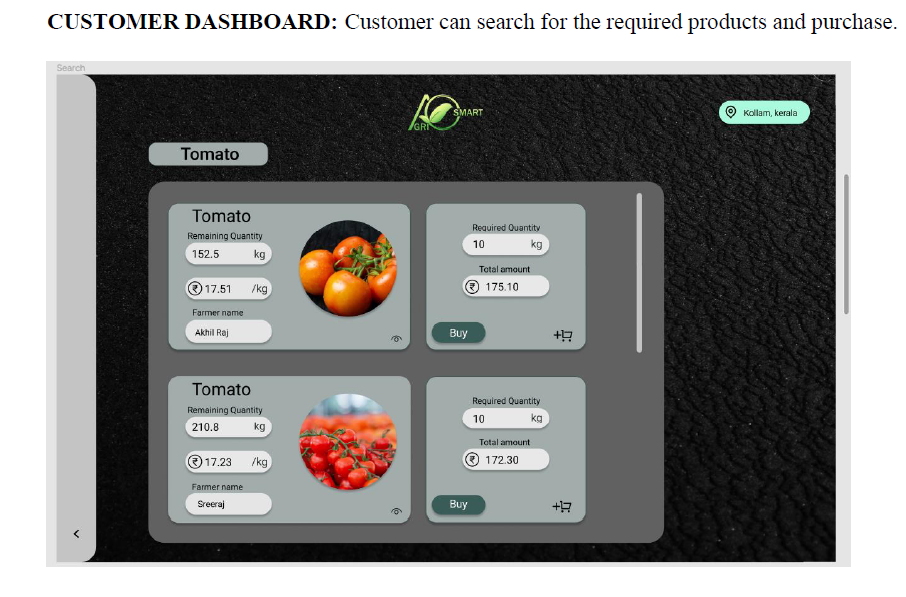
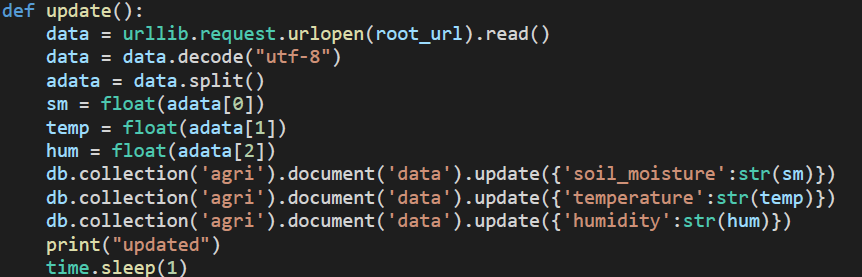

<h1 align="center">AgriSmart</h1>

AgriSmart is an innovative project that aims to revolutionize the agricultural industry by leveraging the power of IoT (Internet of Things) technology. It provides an intelligent monitoring platform framework and a comprehensive system designed to facilitate an advanced agricultural ecosystem.

Through AgriSmart, farmers can access a user-friendly website that serves as a control center, allowing them to efficiently monitor crucial environmental factors such as temperature, humidity, and water level of the soil. By obtaining real-time data on these parameters, farmers can make informed decisions to optimize crop growth and ensure ideal growing conditions.

Additionally, AgriSmart goes beyond monitoring and offers a marketplace feature where farmers can sell their products directly to customers. This integrated system streamlines the sales process, eliminating middlemen and empowering farmers to maximize their profits.

By combining IoT technology, data analytics, and a user-friendly interface, AgriSmart provides farmers with valuable insights and tools to enhance productivity, optimize resource management, and ultimately improve the overall efficiency and profitability of agricultural operations.

# Preview

    

 
 

    

 
 

    

 
 

Code for collecting data from sensors to database

    

<h5 align="center">Connect with me!</h5>

    

